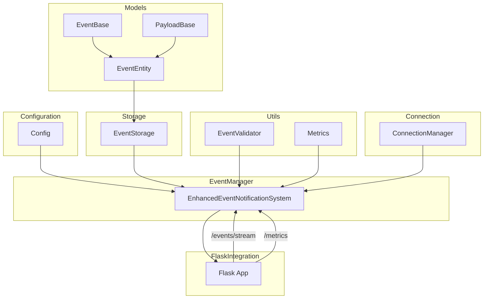

```mermaid
graph TD
    subgraph Configuration
        Config[Config]
    end

    subgraph Models
        EventBase[EventBase]
        EventEntity[EventEntity]
        PayloadBase[PayloadBase]
    end

    subgraph Storage
        EventStorage[EventStorage]
    end

    subgraph Utils
        EventValidator[EventValidator]
        Metrics[Metrics]
    end

    subgraph Connection
        ConnectionManager[ConnectionManager]
    end

    subgraph EventManager
        EnhancedEventNotificationSystem[EnhancedEventNotificationSystem]
    end

    subgraph FlaskIntegration
        FlaskApp[Flask App]
    end

    Config --> EnhancedEventNotificationSystem
    EventBase --> EventEntity
    EventEntity --> EventStorage
    PayloadBase --> EventEntity
    EventStorage --> EnhancedEventNotificationSystem
    EventValidator --> EnhancedEventNotificationSystem
    Metrics --> EnhancedEventNotificationSystem
    ConnectionManager --> EnhancedEventNotificationSystem
    EnhancedEventNotificationSystem --> FlaskApp
    FlaskApp -->|/events/stream| EnhancedEventNotificationSystem
    FlaskApp -->|/metrics| EnhancedEventNotificationSystem
```