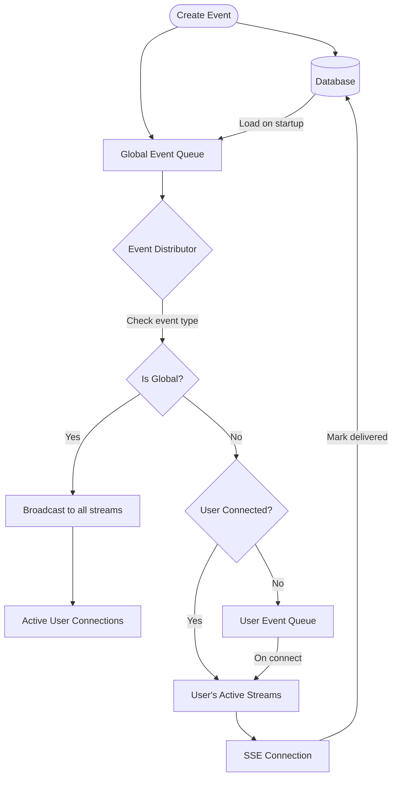

```mermaid
graph TD
    %% Event Creation Flow
    Create([Create Event]) --> DB[(Database)]
    Create --> GQueue[Global Event Queue]
    DB -->|Load on startup| GQueue
    
    %% Distribution Process
    GQueue --> Distributor{Event Distributor}
    
    %% Global vs User Event Logic
    Distributor -->|Check event type| IsGlobal{Is Global?}
    
    %% Global Event Path
    IsGlobal -->|Yes| AllStreams[Broadcast to all streams]
    AllStreams --> ActiveConns[Active User Connections]
    
    %% User Event Path
    IsGlobal -->|No| UserCheck{User Connected?}
    UserCheck -->|Yes| UserStreams[User's Active Streams]
    UserCheck -->|No| UQueue[User Event Queue]
    
    %% Connection Management
    UserStreams --> SSE[SSE Connection]
    UQueue -->|On connect| UserStreams
    
    %% Delivery Confirmation
    SSE -->|Mark delivered| DB
```