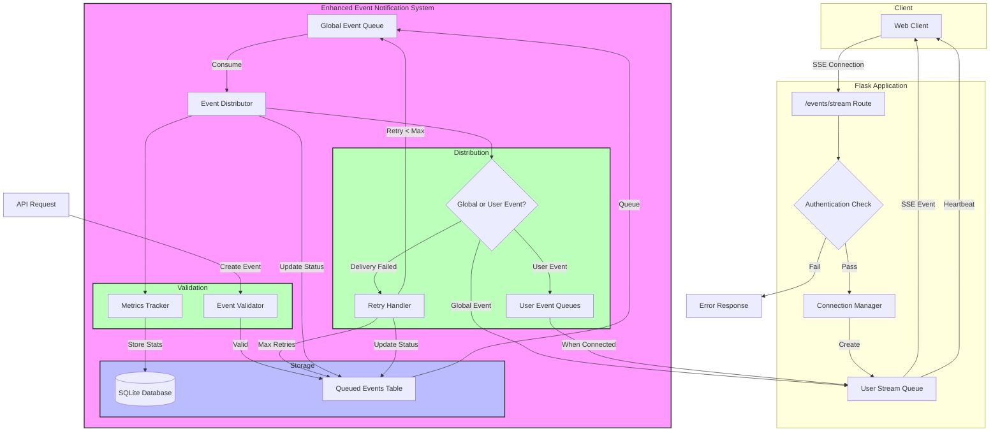

```mermaid
flowchart TB
    subgraph Client
        C[Web Client]
    end

    subgraph Flask["Flask Application"]
        R["/events/stream Route"]
        AUTH{Authentication Check}
        CM[Connection Manager]
        US[User Stream Queue]
    end

    subgraph EventSystem["Enhanced Event Notification System"]
        GQ[Global Event Queue]
        ED[Event Distributor]
        subgraph Storage
            DB[(SQLite Database)]
            QE[Queued Events Table]
        end
        
        subgraph Distribution
            GD{Global or User Event?}
            UQ[User Event Queues]
            RH[Retry Handler]
        end
        
        subgraph Validation
            EV[Event Validator]
            MT[Metrics Tracker]
        end
    end

    %% Client Flow
    C -->|SSE Connection| R
    R --> AUTH
    AUTH -->|Fail| ERR[Error Response]
    AUTH -->|Pass| CM
    CM -->|Create| US
    
    %% Event Creation Flow
    API[API Request] -->|Create Event| EV
    EV -->|Valid| QE
    QE -->|Queue| GQ
    
    %% Distribution Flow
    GQ -->|Consume| ED
    ED --> GD
    GD -->|Global Event| US
    GD -->|User Event| UQ
    UQ -->|When Connected| US
    
    %% Retry Flow
    GD -->|Delivery Failed| RH
    RH -->|Retry < Max| GQ
    RH -->|Max Retries| QE
    
    %% Streaming Flow
    US -->|SSE Event| C
    US -->|Heartbeat| C

    %% Database Updates
    ED -->|Update Status| QE
    RH -->|Update Status| QE
    
    %% Metrics Flow
    ED --> MT
    MT -->|Store Stats| DB

    classDef system fill:#f9f,stroke:#333,stroke-width:2px
    classDef storage fill:#bbf,stroke:#333,stroke-width:2px
    classDef process fill:#bfb,stroke:#333,stroke-width:2px
    
    class EventSystem system
    class Storage storage
    class Distribution process
    class Validation process
```